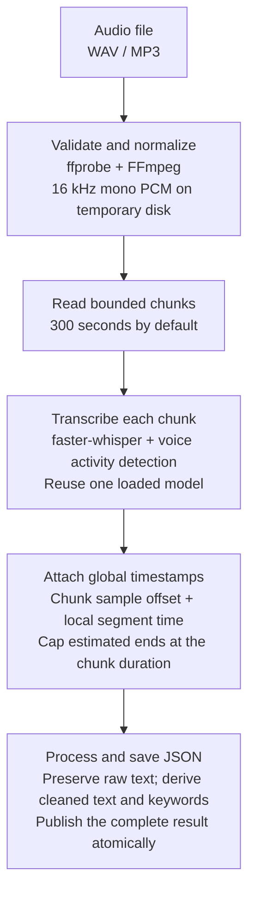

# Audio transcription pipeline

A Python CLI that accepts an audio file, transcribes speech, returns timestamps per segment, and prepares deterministic text features for downstream use. Part 1 is implemented. The distributed service described below is a design proposal for Part 2, not an implemented API.

## Pipeline diagram

This flowchart shows the implemented CLI. Open this README on GitHub, or in a Markdown preview that supports Mermaid, to see the rendered diagram.



Audio moves through validation, normalization, chunked recognition, timestamp conversion, and deterministic post-processing. The output contains the transcript and timestamped segments. The proposed API, queue, and cloud storage are described separately in Part 2 below.

## Local setup and run: MacBook / VS Code

The commands below use macOS's Zsh or Bash terminal. The verified environment is Python 3.13.5 on macOS ARM64 with FFmpeg/ffprobe 9.0.2, faster-whisper 1.2.1, and PyAV 18.1.0. Python 3.11+ is required by the pinned PyAV package; dependency availability can vary by platform and Python version.

### 1. Open the project and terminal

If you already have the project, open its folder in VS Code using **File > Open Folder**. Open **View > Terminal** (Control + backtick on macOS). Run every command below from the folder containing `pipeline.py` and `requirements.txt`. See the [VS Code terminal guide](https://code.visualstudio.com/docs/terminal/getting-started).

For a fresh checkout only, run:

```sh
git clone https://github.com/m-waqas-dev/speech-transcription-pipeline.git
cd speech-transcription-pipeline
```

Check the prerequisites:

```sh
python3 --version
ffmpeg -version
ffprobe -version
```

If FFmpeg is missing and Homebrew is installed, [install FFmpeg](https://formulae.brew.sh/formula/ffmpeg) with:

```sh
brew install ffmpeg
```

This supplies both `ffmpeg` and `ffprobe`. Both must be on `PATH`.

### 2. Create the environment and install dependencies

Create the environment once; skip the first command if a suitable `.venv` already exists:

```sh
python3 -m venv .venv
.venv/bin/python -m pip install -r requirements.txt
.venv/bin/python -m pip check
```

The last command should print `No broken requirements found.` To reproduce the recorded Python 3.13 macOS dependency versions, use this installation command instead:

```sh
.venv/bin/python -m pip install -r requirements.txt -c requirements-tested.txt
```

Every Python command uses `.venv/bin/python` explicitly, so environment activation is optional. A shell alias such as `python=/usr/local/bin/python3` can otherwise select the global installation even after activation. To confirm the interpreter and decoder version:

```sh
.venv/bin/python -c 'import sys, av; print(sys.executable); print("PyAV:", av.__version__)'
```

The interpreter path should end in this project's `.venv/bin/python`, and PyAV should be `18.1.0`. On Windows, use `.venv\Scripts\python.exe` in place of `.venv/bin/python` and install FFmpeg through your platform's package manager; the walkthrough here was verified on macOS.

### 3. Run the automated tests

```sh
.venv/bin/python -m unittest -v test_pipeline.py
```

The verified result is **16 tests passed**, ending with `OK`. These tests use injected recognizers and do not download a speech model. Five decoder integration tests require FFmpeg/ffprobe and explicitly skip when those tools are missing. `OK (skipped=5)` therefore does not mean all 16 tests ran. See [VALIDATION.md](VALIDATION.md) for the recorded checks.

### 4. Run real speech transcription

For the included English WAV demo on a MacBook, use CPU and INT8:

```sh
.venv/bin/python pipeline.py examples/demo.wav --model tiny.en --language en --device cpu --compute-type int8 --keyword update --output transcript.json
```

The named model downloads on first use and is cached for later runs. Wait for the terminal prompt to return. On success, the command prints:

```json
{"status": "completed", "output": "transcript.json"}
```

Then display the full result:

```sh
cat transcript.json
```

Or display only the recognized speech:

```sh
.venv/bin/python -c 'import json; print(json.load(open("transcript.json"))["text"])'
```

The verified demo transcript is:

> Hello, this is a test of the transcription pipeline. Please send the project update tomorrow.

The JSON also contains `mock: false`, duration `5.767`, timestamped segments, and an `update` keyword hit. Open `transcript.json` from VS Code's Explorer to view the same result in the editor. Only inspect it after a successful run: a failed run preserves any previous output file.

### 5. Run MP3 or your own recording

Run the included MP3 and save it separately:

```sh
.venv/bin/python pipeline.py examples/demo.mp3 --model tiny.en --language en --device cpu --compute-type int8 --keyword update --output mp3-result.json
cat mp3-result.json
```

For your own English recording, replace the quoted input path with a real file. Quotes are needed when the path contains spaces:

```sh
.venv/bin/python pipeline.py "/path/to/my recording.wav" --model tiny.en --language en --device cpu --compute-type int8 --keyword update --keyword project --output transcript.json
```

For other languages, use a multilingual model such as `base` and set the language code, or omit `--language` for detection:

```sh
.venv/bin/python pipeline.py "/path/to/my recording.mp3" --model base --device cpu --compute-type int8 --output transcript.json
```

`base` is the default model. The documented real-model smoke tests use `tiny.en`; `base` was not benchmarked. Larger models may improve recognition on some recordings at greater compute cost.

### 6. Exercise the pipeline without a speech model

```sh
.venv/bin/python pipeline.py examples/demo.wav --mock --chunk-seconds 3 --output mock.json
cat mock.json
```

This checks decoding, multiple chunks, timestamps, processing, and JSON output without a model download. It deliberately returns `Mock transcription.`, including for silent input, and labels the result `mock: true`. Use the real command in step 4 when demonstrating speech recognition.

### 7. Commands for subsequent runs or a video demo

Once setup is complete, open the project terminal and run these one at a time. Continue to the next command after checking the previous result:

```sh
.venv/bin/python -m unittest -v test_pipeline.py
.venv/bin/python pipeline.py examples/demo.wav --model tiny.en --language en --device cpu --compute-type int8 --keyword update --output transcript.json
cat transcript.json
```

For a brief walkthrough, show the README diagram, the test result ending in `OK`, the transcription completion message, and the transcript text with its timestamps and keyword hit. Run the model once before recording to finish the initial download.

## Command-line reference

```sh
.venv/bin/python pipeline.py --help
```

| Argument | Default | Purpose |
| --- | --- | --- |
| `audio` | Required | Local input audio path. |
| `--output` | `transcript.json` | JSON destination; replaced only after the whole run succeeds. |
| `--model` | `base` | Whisper model name or local converted-model directory; `tiny.en` is the English demo model. |
| `--language` | Auto-detect per chunk | Language code such as `en`. |
| `--device` | `cpu` | `cpu` or `cuda`; use `cpu` on a MacBook. CUDA requires a compatible NVIDIA setup. |
| `--compute-type` | `int8` | Backend compute type; the verified Mac demo uses `int8`. |
| `--keyword` | None | Keyword to match; repeat the flag for multiple keywords. |
| `--chunk-seconds` | `300` | Chunk duration from 1 to 900 seconds. |
| `--max-seconds` | `7200` | Input duration limit from 1 to 7200 seconds. |
| `--max-bytes` | `262144000` | Positive maximum input size in bytes (250 MiB by default). |
| `--model-cache` | Backend default cache | Directory for downloaded models. |
| `--mock` | Off | Return labeled fake text without loading a speech model. |
| `-h`, `--help` | — | Display available arguments. |

To choose a project-local model cache:

```sh
.venv/bin/python pipeline.py examples/demo.wav --model tiny.en --language en --device cpu --compute-type int8 --model-cache .model-cache --output transcript.json
```

For offline use after provisioning a model, pass the actual converted-model directory containing `model.bin` and its companion files. Replace this example path; a cache's top-level directory is not itself the model directory:

```sh
.venv/bin/python pipeline.py examples/demo.wav --model "/path/to/converted-model" --language en --device cpu --compute-type int8 --output transcript.json
```

## Troubleshooting local runs

| Symptom | What to do |
| --- | --- |
| `python: command not found`, or the wrong package versions load | Use `.venv/bin/python` for both installation and execution. |
| `.venv/bin/python: no such file or directory` | Open the project folder, then complete environment setup in step 2. |
| Missing faster-whisper or another Python package | Run `.venv/bin/python -m pip install -r requirements.txt`. |
| Missing `ffmpeg` / `ffprobe`, or `dependency_missing` | Install FFmpeg, then verify both version commands in step 1. |
| `transcription_failed` with faster-whisper 1.2.1 and PyAV 19 | PyAV 19 removed an option this faster-whisper version uses. Reinstall the pinned requirements and run with the project's interpreter; see the command below. Other causes can produce this error too. |
| Hugging Face unauthenticated-request warning | This warning alone is not a failure. The public demo model ran successfully without a token; authentication can help with download rate limits. |
| `model_load_failed` | Check the first-download network connection and model name, or verify the local converted-model directory. |
| Input file missing or invalid | Check the path and quote it if it contains spaces. Confirm it is a non-empty, decodable audio file. |

Repair dependencies and verify their consistency:

```sh
.venv/bin/python -m pip install -r requirements.txt -c requirements-tested.txt
.venv/bin/python -m pip check
```

Then rerun the real WAV command in step 4. The project pins PyAV to `18.1.0` to avoid the reproduced `metadata_errors` incompatibility. For the recorded failure and successful recheck, see [VALIDATION.md](VALIDATION.md).

## Implementation

`pipeline.py` contains these stages as separate functions. `run_pipeline` coordinates them, while `main` handles arguments and structured errors. Tests inject a recognizer so failures and edge cases can be checked deterministically without a network download.

### Input and formats

The CLI accepts a local path, for example WAV or MP3. The file must exist, be a non-empty regular file, and fit the default 250 MiB limit. The decoder examines actual media, so changing a filename extension does not turn an invalid file into valid audio. Inputs with no audio stream are rejected.

FFmpeg normalizes sample rate, channel count, and sample representation. The prototype selects the first audio stream and downmixes its channels to mono. For a recording with one participant per channel, a production variant should preserve and transcribe channels separately. Resampling cannot restore information missing from the source.

External media processes receive argument lists without `shell=True`, have timeouts, and are restricted to local file/pipe protocols. This is not a complete hostile-media sandbox. An Internet-facing worker should run decoders in an isolated container with restricted filesystem access, no network, and CPU/memory/disk limits.

### Recognition and timestamps

The backend is [faster-whisper](https://github.com/SYSTRAN/faster-whisper), using its `WhisperModel.transcribe` API. The model is loaded once per run and reused across chunks. Transcription uses beam size 5, voice activity detection, and `task="transcribe"`. The segment generator is consumed inside error handling because inference occurs during iteration.

An explicit language avoids repeated detection. If omitted, the backend detects language independently for each chunk. `languages` records detected languages only for chunks producing text; it is not a guarantee of complete language identification. Silence may produce an empty transcript successfully. VAD reduces unwanted non-speech output but does not guarantee that hallucinations cannot occur.

Segment times are seconds relative to the beginning of the decoded recording. For a chunk beginning after `consumed_samples`:

```python
offset = consumed_samples / 16000
global_start = offset + segment.start
global_end = offset + segment.end
```

Offsets come from integer sample counts, including a shorter final chunk. Timestamp values are checked for finiteness and order, and starts must be within the chunk. A model can extend an estimated end into its padded audio window: the implementation caps that end at the chunk duration and sets `timestamp_clamped: true` for transparency. Rounding to three decimals is a serialization choice, not a claim of millisecond accuracy. These are estimated segment boundaries, not forced-aligned word times.

### Long recordings and resource limits

The default chunk length is 300 seconds. Decoded audio is stored on temporary disk, and only one chunk is passed to ASR at a time. The model and one chunk dominate inference memory; the list of output segments still grows with recording length. This is a bounded-file batch pipeline, not live streaming.

The maximum duration is two hours and can be reduced with `--max-seconds`. The decoder stops after the configured maximum plus one second, and the actual decoded sample count is checked. This prevents untrusted or absent duration metadata from producing unbounded PCM. At 16 kHz, mono, 16-bit, PCM uses roughly 115 MB per hour, so the two-hour cap needs roughly 230 MB of temporary normalized audio, plus a chunk and model files. Temporary files are removed on success and ordinary exception paths.

Fixed chunk boundaries can cut through a word, and independent chunks lose cross-boundary linguistic context. The prototype makes that tradeoff explicit. A higher-quality service should split at detected silence or use overlap with timestamp-aware duplicate reconciliation. Simply concatenating overlapping transcripts duplicates speech. No overlap reconciliation, diarization, chunk checkpoints, or inference deadline is implemented here.

### Downstream processing

Each segment's `text` retains the recognizer's output. The top-level `text` joins trimmed segment texts for convenience. `cleaned_text` applies Unicode NFC normalization and collapses whitespace. It does not rewrite names, remove repeated words, or invent punctuation.

`token_count` is a simple Unicode regex token count, not a language-aware word count. Optional repeated `--keyword` arguments produce case-insensitive boundary matches within each segment. Keyword hit timestamps refer to the containing segment; they are not word timestamps. Phrases spanning segment boundaries are not matched. These limitations keep processing predictable and auditable.

### Result schema

```json
{
  "schema_version": "1.0",
  "status": "completed",
  "mock": false,
  "duration_seconds": 4.0,
  "timestamp_unit": "seconds",
  "languages": ["en"],
  "segments": [
    {"id": 0, "chunk_index": 0, "start": 0.2, "end": 2.8, "text": " Project update."}
  ],
  "text": "Project update.",
  "cleaned_text": "Project update.",
  "token_count": 2,
  "keyword_hits": [
    {"keyword": "update", "segment_id": 0, "count": 1, "start": 0.2, "end": 2.8}
  ]
}
```

The values above are illustrative. Actual results also include source SHA-256, source audio metadata, and inference configuration. The checksum aids traceability; it is not a security credential or proof of ownership. For reproducible deployment, pin the model artifact/revision and the complete environment as well as the application version.

### Errors and output integrity

The CLI exits 0 on success, 1 on processing failure, and 2 on invalid command-line arguments. Processing errors are JSON on stderr with a stable code and a short message. Decoder diagnostics and transcript contents are not logged routinely. A result is written to a temporary file in the output directory, flushed, then replaced atomically after the whole job succeeds. A failed transcription does not publish a partial result. An existing output is replaced on success; a failure leaves any old output intact, so callers must check the exit status. The output cannot be the input audio or a hard link to it.

## Part 2: proposed service design

### Concurrent uploads

Use authenticated upload sessions and short-lived presigned URLs for a private object store. Clients upload directly, keeping audio traffic out of inference workers. Verify object existence, ownership, and limits before accepting a job. Persist a job and transactional outbox event together, then dispatch to a durable queue. A bounded worker pool reuses loaded models and limits concurrency according to measured CPU/GPU memory. Apply tenant quotas, idempotency keys, rate limits, queue limits, and backpressure. Scale on queue age and processing latency. An async route alone does not prevent inference from blocking a web server.

### Storage

Store original audio and large transcript JSON in private object storage. Keep job ownership, status, object references, attempts, timestamps, checksum, model/configuration version, and safe error codes in PostgreSQL. Index segments separately if search is needed. Keep raw and processed text separate. Authorize every access and issue short-lived download URLs. Use TLS, encryption at rest, retention periods, and deletion covering derived artifacts. Keep private speech out of routine logs.

### Retries and recovery

Retry transient timeouts, throttling, storage failures, and worker loss with capped exponential backoff and jitter. Honor server retry hints. Do not blindly retry invalid media or authorization failures. Use leases and heartbeats to reclaim abandoned jobs. Checkpoint chunks under job ID, input checksum, model/configuration version, and chunk index. Queue delivery can repeat, so writes must be idempotent. Conditional status transitions and fencing tokens stop stale workers from overwriting a newer attempt. Acknowledge messages only after durable writes. Exhausted retries produce a failed job and a dead-letter entry for investigation.

### API

| Endpoint | Behavior |
| --- | --- |
| `POST /v1/uploads` | Authenticate; create upload session and return object ID and presigned URL. |
| `POST /v1/transcriptions` | Validate owned, completed upload and options; accept `Idempotency-Key`; return `202`, job ID and `Location`. |
| `GET /v1/transcriptions/{id}` | Authorize owner; return queued/processing/completed/failed, progress and safe errors. |
| `GET /v1/transcriptions/{id}/result` | Authorize owner; return versioned text and timestamped segments when ready. |

Small-file multipart input is an optional alternative. Validate request schemas and size/duration limits. Use suitable 4xx responses for client errors, 429 for throttling, and 503 for temporary unavailability. Optional signed webhooks can report completion and must themselves tolerate retries and duplicates. These endpoints are design only.

## Validation and tradeoffs

Run `.venv/bin/python -m unittest -v test_pipeline.py`. Tests cover sample offsets and final chunks, timestamp validation, lazy failures, no-speech results, raw-text preservation, keyword matching, atomic output, file/byte limits, source overwrite protection, decoder timeouts, real WAV/MP3 decoding, stereo resampling, corrupt input, duration limits, and no partial publication after inference failure. Decoder tests skip explicitly if FFmpeg tools are unavailable.

See `VALIDATION.md` for the actual test run and real-model smoke-test results. Mock tests validate pipeline behavior, not recognition accuracy. A smoke test on synthetic speech is not an accuracy benchmark. Before production, measure word error rate against human-reviewed reference transcripts, timestamp error, latency, real-time factor, peak memory, and failure rate across target languages, accents, silence, noise, and long recordings. Include speech crossing chunk boundaries. No model or implementation can promise perfect transcription for arbitrary audio.

## Repository contents

- `pipeline.py`: runnable implementation.
- `test_pipeline.py`: deterministic contracts and real decoder tests.
- `requirements.txt`: pinned ASR and compatible audio decoder dependencies; `requirements-tested.txt` records the tested environment.
- `examples/`: synthetic example audio and actual example output.
- `VALIDATION.md`: what was actually verified.

## References

- [faster-whisper API and installation](https://github.com/SYSTRAN/faster-whisper)
- [FFmpeg command-line documentation](https://ffmpeg.org/ffmpeg.html)
- [Python PCM WAV reader](https://docs.python.org/3/library/wave.html)
